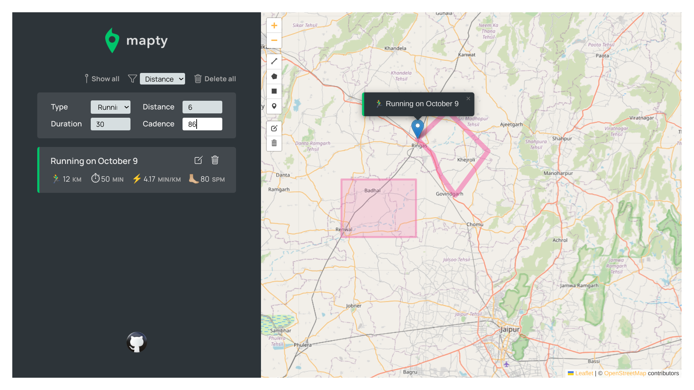

# Activity tracker

## Description

Mapty is an activity tracker, You can mark your workouts on map and trace path taken, kilometers covered, time spent working out and cadence.

It also stores user input in local storage API, as a result refreshing the page won't wipe your past workouts.

## How to run the Project

Project is live at [*THIS LINK*](https://siddhart-singh.github.io/Acitvity-Tracker/)

## How to use the Project

1. Open the link above.
2. Upon loading, It will ask for location permission.
3. Click anywhere on them map you want to record your workout from.
4. Fill your workout stats in dialog box that appears in left section and press Enter.
5. You can edit or remove your workout by clicking edit or dustbin icon.
6. Activities can be sorted by distance or duration.
7. All activities can be deleted by delete all button.
8. You can markup your path by top left widget on map. You can draw shapes, trace your path or add additional markers.

## Technology

1. HTML, CSS
2. JavaScript
3. [LeafLet.js](https://leafletjs.com/)
3. Linux
4. [Git](https://git-scm.com/)
5. [Ion Icons](https://ionic.io/ionicons)
6. [Icons8](https://icons8.com/)
7. [Google Fonts](https://fonts.google.com/)
